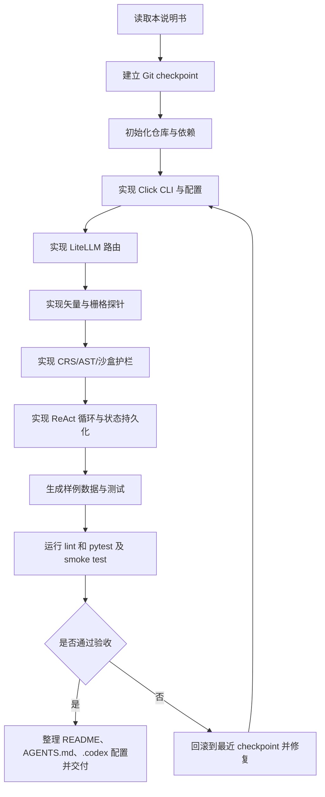

# 面向 Codex 的本地 GIS Agent Harness 一体化交付 Markdown

## 执行摘要

我将把现有原稿收敛为一份可直接交给 Codex 的单文档执行说明，默认目标是交付一个本地 GIS Agent Harness MVP。  
这份说明补齐了原稿缺失的交付物、目录、文件树、验收标准、测试矩阵、回滚策略与停止条件。  
我把所有未指定维度都显式标注为“未指定”，并为每项给出一个可直接执行的默认方案。  
我同时保留分阶段子任务模板，因为 Codex 官方明确建议把复杂任务拆为更小、可验证、可停止的步骤。citeturn6view7turn6view11  
技术主线仍然遵循原稿：Click CLI、LiteLLM 路由、Fiona/Rasterio/GeoPandas 空间探针、subprocess + AST 护栏与 ReAct 自愈。fileciteturn0file0 citeturn7view0turn7view5turn6view1turn9view0turn7view4turn14view0turn6view5

## 目标产出与默认决策

我当前已提供的核心背景，是一份面向本地 GeoTIFF、Shapefile、GeoPackage 自动化处理的 GIS Agent Harness 架构原稿；原稿已经把方向判断锁定得很准确，但仍偏“架构论证”，不足以直接作为 Codex 的一次性交付目标。我需要把它补足成“单仓库、可执行、可回滚、可验收”的工程说明书。fileciteturn0file0

| 维度 | 当前状态 | 我给 Codex 的默认值 | 说明 |
|---|---|---|---|
| 目标具体功能 | 未指定 | 本地 GIS Agent Harness MVP | 支持矢量/栅格元数据探测、CRS 对齐、受限脚本执行、错误观察反馈、自愈重试、状态快照 |
| 交付物格式 | 未指定 | 可运行 Python 仓库 + 文档 + 测试 + 示例配置 | 交付后应可在新环境安装并运行 smoke test |
| 运行环境 | 未指定 | Python 3.11，本地优先，兼容 macOS / Windows / Linux | 避免平台硬编码，默认本地目录执行 |
| 依赖项 | 未指定 | `click`、`litellm`、`geopandas`、`fiona`、`rasterio`、`shapely`、`pyproj`、`pytest` | 版本由 Codex 在执行时解析为兼容稳定版 |
| 性能标准 | 未指定 | 探针路径只读且尽量只读元数据，不默认全量读栅格 | 避免冷启动慢与 OOM |
| 质量标准 | 未指定 | 单元测试 + 集成测试 + 端到端 smoke test 全通过 | 关键护栏必须可测试 |
| 部署方式 | 未指定 | 本地 CLI 为主，Docker / Codex cloud 为可选扩展 | 不把云或桌面 GIS 挂钩作为 MVP 前置 |
| 输入文件内容 | 未指定 | 若真实数据未提供，则自动生成最小 GeoTIFF / GPKG / Shapefile 测试夹具 | 保证项目可自举 |
| 时间预算 | 未指定 | 以“达成验收标准”为停止条件，而不是按工时停止 | 防止 Codex 漫无边界扩写 |
| 团队角色 | 未指定 | 我 + Codex 的单人交付模式 | 文档、目录和命名按最小协作成本设计 |

我当前掌握的输入文件与资源清单如下；凡是没有实际给到 Codex 的，都必须在说明书中被标为“未提供”，并附带默认兜底方案。

| 资源 | 状态 | 处理策略 |
|---|---|---|
| 架构原稿文本 | 已提供 | 作为需求背景与设计约束来源 |
| 目标代码仓库 | 未提供 | 视为当前目录为空仓库或新仓库 |
| 真实 GeoTIFF 样例 | 未提供 | 自动生成最小测试夹具 |
| 真实 Shapefile / GPKG 样例 | 未提供 | 自动生成最小测试夹具 |
| OpenAI / LiteLLM 配置 | 未提供 | 生成 `.env.example`、`litellm-config.yaml`，测试时使用 mock |
| 现有 CI 配置 | 未提供 | 自动生成最小本地测试命令与可选 GitHub Actions |
| 现有 `.codex/config.toml` | 未提供 | 自动生成建议模板 |
| 现有 `AGENTS.md` | 未提供 | 自动生成项目级指令文件 |

我之所以把这些默认值设为“Python + 本地 GIS Python 栈 + 可验证 CLI”，不是拍脑袋，而是因为官方能力边界与原稿高度一致：Click 官方明确支持命令任意嵌套与运行时惰性加载子命令；LiteLLM 提供 OpenAI-compatible gateway，并支持重试和 fallback；Fiona 的集合对象聚焦于 format drivers、CRS、bounds、schema；Rasterio 数据集暴露 `indexes`、`dtypes`、`nodatavals`、`transform` 等关键属性；GeoPandas 明确区分 `set_crs()` 与 `to_crs()`，并提供 `make_valid()` 进行几何修复。citeturn7view0turn6view0turn7view5turn6view10turn2search0turn6view1turn9view0turn8search0turn7view3turn7view4turn15view0

## 实现选型与推荐方案

| 方案 | 核心技术栈 | 优点 | 风险 | 我的结论 |
|---|---|---|---|---|
| Python 本地优先 CLI | Python + Click + GeoPandas/Fiona/Rasterio + LiteLLM | 与 GIS Python 生态对齐，API 直接，测试与文档成熟，适合 Codex 改写仓库 | 依赖较重，GDAL 相关安装要处理好 | **主推** |
| Python Docker 优先 | 同上 + Dockerfile / devcontainer | 环境复现性最好，便于多人协作和 cloud task | 首轮复杂度更高，不适合作为唯一 MVP 入口 | 可选增强 |
| TypeScript 包装 CLI | Node.js + 子进程调用 GDAL / Python | 前端/Node 团队更熟悉 | 本地 GIS 能力仍要落回 Python/GDAL，桥接成本高 | 不推荐作为首版主线 |
| 桌面 GIS Hook 优先 | ArcPy / QGIS Python API | 可接商业/桌面 GIS 内核 | 环境依赖重、不可移植、MVP 边界失控 | 作为后续扩展 |
| 纯对话式脚本生成 | 无严格仓库结构 | 进入门槛低 | 没有测试、回滚、状态持久化，最易失控 | 不推荐 |

我把“Python + Click + LiteLLM + GeoPandas/Fiona/Rasterio + 本地优先 CLI”定为首选，是因为这条技术线同时满足了原稿中的空间上下文工程、CRS 护栏、自愈循环与模块化控制台要求，也贴合官方文档可验证的能力边界：Click 原生支持嵌套命令和惰性加载；LiteLLM 提供自托管 OpenAI-compatible proxy、异常统一、重试与 fallback；Fiona/Rasterio/GeoPandas 组合正好覆盖矢量 schema、栅格 transform，以及 CRS 赋值、重投影和无效几何修复。fileciteturn0file0 citeturn7view0turn6view0turn7view5turn6view10turn6view1turn9view0turn6view3turn7view3turn7view4turn15view0

如果我让 Codex 或类似工具直接在仓库里工作，我更适合按“本地优先、云为辅”的方式写说明书。OpenAI 官方说明 Codex 默认可在当前项目目录中读文件、改文件、运行命令；它也支持项目级 `.codex/config.toml` 配置。若我后续改用 cloud task，环境可以通过 setup script 安装依赖，并且当仓库中存在 `AGENTS.md` 时，Codex 会利用它发现项目级 lint 与 test 命令。citeturn6view9turn7view2turn10view0turn7view1

## 顺序子任务与 Codex 提示模板

我将复杂任务拆成顺序子任务，不是为了增加流程感，而是因为 Codex 官方明确建议：复杂工作要拆成更小、聚焦、可验证的步骤，并在提示中写出复现、校验与停止规则；同时，Codex 官方也明确建议在每个任务前后保留 Git checkpoint，便于撤销和回滚。citeturn6view7turn6view11turn6view9

| 优先级 | 子任务 | 依赖关系 | 主要输出 |
|---|---|---|---|
| P0 | 仓库脚手架与依赖清单 | 无 | `pyproject.toml`、`requirements.txt`、基础目录 |
| P0 | CLI 与配置层 | 依赖脚手架 | `cli.py`、配置模型、入口命令 |
| P1 | 模型路由与容灾 | 依赖配置层 | `llm_router.py`、`litellm-config.yaml` |
| P1 | 空间探针 | 依赖脚手架 | `spatial_tools.py` |
| P1 | 护栏与安全执行 | 依赖脚手架与空间探针 | `guardrails.py`、`sandbox.py` |
| P2 | ReAct 循环与状态持久化 | 依赖路由 + 探针 + 护栏 | `agent_loop.py`、`state_store.py` |
| P2 | 测试夹具与自动化测试 | 依赖全部核心模块 | `tests/`、`scripts/generate_sample_data.py` |
| P3 | 文档与最终交付整合 | 依赖全部 | `README.md`、`docs/`、`AGENTS.md`、`.codex/config.toml` |

**提示模板 A**

```text
我需要你在当前仓库完成“仓库脚手架与依赖清单”子任务。

任务描述：
- 初始化一个面向本地 GIS Agent Harness 的 Python 仓库。
- 使用 src 布局。
- 产出后续子任务可依赖的最小目录结构与安装入口。

输入示例：
- 当前目录为空仓库，或仅有 README。
- 我尚未提供现成代码、CI、配置文件。

输出示例：
- pyproject.toml
- requirements.txt
- src/gis_agent_harness/__init__.py
- src/gis_agent_harness/cli.py
- tests/__init__.py

约束条件：
- 语言固定为 Python 3.11。
- 依赖仅包含 click、litellm、geopandas、fiona、rasterio、shapely、pyproj、pytest 及必要的最小辅助包。
- 暂时不要引入数据库、Web 服务或前端框架。
- 目录命名统一使用 gis_agent_harness。

验收标准：
- `pip install -e .` 成功。
- `python -m gis_agent_harness.cli --help` 能输出帮助信息。
- 目录结构清晰，不出现散落在仓库根目录的业务脚本。

错误处理与回滚策略：
- 若依赖解析冲突，优先保留 pyproject.toml 为主事实源，并同步修正 requirements.txt。
- 若命名与目录结构不统一，回滚当前任务改动并统一重建为 src 布局。

所需文件路径与命名约定：
- src/gis_agent_harness/
- tests/
- docs/
- scripts/
- .codex/
```

**提示模板 B**

```text
我需要你在当前仓库完成“CLI 与配置层”子任务。

任务描述：
- 用 Click 建立顶层命令组与子命令结构。
- 设计 inspect-vector、inspect-raster、run-task、show-state 等命令骨架。
- 为后续惰性加载重依赖预留结构。

输入示例：
- 已存在 pyproject.toml 与 src/gis_agent_harness 基础目录。

输出示例：
- src/gis_agent_harness/cli.py
- src/gis_agent_harness/config.py
- src/gis_agent_harness/logging_utils.py

约束条件：
- 顶层必须采用 Click group。
- 不允许把所有逻辑都堆在一个入口函数中。
- CLI 只负责参数解析、调度与结果输出，不承载具体 GIS 算法。
- 为后续 lazy import 预留接口。

验收标准：
- `python -m gis_agent_harness.cli --help`
- `python -m gis_agent_harness.cli inspect-vector --help`
- `python -m gis_agent_harness.cli inspect-raster --help`
- 帮助信息可读且参数命名稳定。

错误处理与回滚策略：
- 若帮助命令触发了重依赖全量导入，回滚当前导入方式并改为函数内延迟导入。
- 若命令语义不清晰，重命名为 inspect / run / state 这类稳定术语。

所需文件路径与命名约定：
- src/gis_agent_harness/cli.py
- src/gis_agent_harness/config.py
- 命令名使用短横线，模块名使用下划线
```

**提示模板 C**

```text
我需要你在当前仓库完成“模型路由与容灾”子任务。

任务描述：
- 实现一个最小的 LiteLLM 路由层，封装模型名、重试、fallback、错误映射与 mock 模式。
- 让业务层只依赖统一接口，而不直接依赖某一家模型 SDK。

输入示例：
- 未提供 API key。
- 未提供现成 litellm 配置。
- 测试环境必须支持 mock。

输出示例：
- src/gis_agent_harness/llm_router.py
- litellm-config.yaml
- .env.example

约束条件：
- 不把真实密钥写入仓库。
- 提供 mock client，使测试无需真实联网。
- 路由层输出统一的数据结构，至少包含 prompt、response、model_used、attempts、fallback_used。

验收标准：
- 单元测试可模拟主模型失败后切换备用模型。
- 在无密钥环境下，mock 测试仍可通过。
- 错误信息能被上层 agent loop 消费。

错误处理与回滚策略：
- 若 LiteLLM 集成阻塞首版进度，保留统一接口并先接入 mock 实现，再逐步补上真实路由。
- 若 fallback 逻辑过于复杂，先实现 general fallback 和 retry，再把 context fallback 设计成可扩展项。

所需文件路径与命名约定：
- src/gis_agent_harness/llm_router.py
- litellm-config.yaml
- .env.example
```

**提示模板 D**

```text
我需要你在当前仓库完成“空间探针”子任务。

任务描述：
- 实现矢量探针与栅格探针。
- 矢量探针返回 driver、crs、bounds、schema、前若干条属性样本。
- 栅格探针返回 width、height、count、indexes、dtypes、nodatavals、crs、bounds、transform。

输入示例：
- tests/fixtures/vector/sample.gpkg
- tests/fixtures/vector/sample.shp
- tests/fixtures/raster/sample.tif

输出示例：
- src/gis_agent_harness/spatial_tools.py
- 统一的 inspect 数据结构和可序列化输出

约束条件：
- 探针默认为只读。
- 栅格探针默认不得全量 `read()` 整个影像，只读取头信息和必要元数据。
- 坐标系转换边界时使用 transform_bounds 一类的严密方法。
- 缺字段、缺 CRS、坏路径都要给出结构化异常。

验收标准：
- inspect-vector 命令可稳定输出 schema 与 crs。
- inspect-raster 命令可稳定输出 transform 与 nodata。
- 样例数据不存在时给出明确错误，不出现难懂 traceback 直出。

错误处理与回滚策略：
- 若 Shapefile 与 GPKG 解析差异造成返回值不一致，先统一成内部标准字典。
- 若读取失败来自数据损坏，保留原始异常摘要并包装为领域错误对象。

所需文件路径与命名约定：
- src/gis_agent_harness/spatial_tools.py
- tests/test_spatial_tools.py
```

**提示模板 E**

```text
我需要你在当前仓库完成“护栏与安全执行”子任务。

任务描述：
- 在执行模型生成脚本前，加入 CRS 前置检查、AST 静态审查、受限 subprocess 执行与 stderr/stdout 捕获。
- 对 CRS 缺失、CRS 不匹配、非法 import、危险系统调用、超时等情况给出结构化 Observation。

输入示例：
- 两个 CRS 不一致的数据源路径
- 一段包含 os.system 的生成脚本
- 一段无限循环脚本

输出示例：
- src/gis_agent_harness/guardrails.py
- src/gis_agent_harness/sandbox.py
- tests/test_guardrails.py

约束条件：
- `set_crs` 只用于声明或修正缺失/错误 CRS，不得冒充真实重投影。
- 真实重投影必须使用 `to_crs`。
- 禁止直接执行 shell 字符串；优先执行受控 Python 文件。
- subprocess 需要 timeout、returncode、stdout、stderr 全部保留。

验收标准：
- 非法 import 会被拦截。
- 无限循环会被 timeout 中断。
- CRS mismatch 会在实际 overlay/sjoin 前被发现并阻断。
- 观测对象可被 agent loop 直接消费。

错误处理与回滚策略：
- 若 AST 白名单过严导致合法 GIS 包也被拦截，回滚到最近稳定白名单并补测试。
- 若 subprocess 输出丢失，优先修复 I/O 捕获逻辑，再放开更多执行能力。

所需文件路径与命名约定：
- src/gis_agent_harness/guardrails.py
- src/gis_agent_harness/sandbox.py
- .runs/
```

**提示模板 F**

```text
我需要你在当前仓库完成“ReAct 循环与状态持久化”子任务。

任务描述：
- 实现一个最小可用的 agent loop：Thought -> Action -> Observation -> Fix。
- 为重试次数、状态快照、任务摘要、失败记录建立持久化层。
- 支持 mock LLM，以便本地测试完整流程。

输入示例：
- 用户任务：读取 EPSG 不一致的矢量与栅格，完成对齐后裁剪
- 观测：CRS mismatch、invalid geometry、timeout

输出示例：
- src/gis_agent_harness/agent_loop.py
- src/gis_agent_harness/state_store.py
- AGENT_STATE.md
- tests/test_agent_loop.py

约束条件：
- 必须有最大迭代次数。
- 每次失败后都要写入状态快照。
- 状态文件为追加式记录，方便恢复。
- 对同一错误不能无限重试。

验收标准：
- mock 模式下可完整跑通至少一个“失败后修复成功”的演示。
- 达到最大重试后能优雅退出并给出总结。
- 会把关键路径写入 AGENT_STATE.md。

错误处理与回滚策略：
- 若循环出现重复无效修复，加入重复错误指纹检测并提前停止。
- 若状态文件格式不稳定，统一改为 Markdown + YAML front matter 或 JSON Lines。

所需文件路径与命名约定：
- src/gis_agent_harness/agent_loop.py
- src/gis_agent_harness/state_store.py
- AGENT_STATE.md
```

**提示模板 G**

```text
我需要你在当前仓库完成“测试、文档与最终交付整合”子任务。

任务描述：
- 生成测试夹具、自动化测试、README、docs、AGENTS.md、.codex/config.toml 建议模板。
- 给出本地安装、运行、测试、演示命令。
- 生成一个 demo_task 或 test_run 脚本。

输入示例：
- 当前仓库已有核心源码。
- 真实数据和真实 API key 仍可能缺失。

输出示例：
- scripts/generate_sample_data.py
- scripts/demo_task.py
- tests/test_cli.py
- tests/test_e2e_smoke.py
- README.md
- docs/architecture.md
- AGENTS.md
- .codex/config.toml

约束条件：
- 所有测试默认离线可跑，LLM 使用 mock。
- README 需清楚写明限制与非目标。
- 测试命令必须一键执行。
- 最终文档要写明回滚策略与停止条件。

验收标准：
- `pytest -q` 通过。
- README 中的命令可复制执行。
- smoke test 可在全新环境完成。
- 失败时能定位到是依赖、数据、路由还是护栏问题。

错误处理与回滚策略：
- 若 e2e 依赖真实外部服务，必须先回滚为 mock e2e。
- 若 README 与实际命令不一致，自动以测试通过的命令为准修正文档。

所需文件路径与命名约定：
- scripts/
- tests/
- docs/
- AGENTS.md
- .codex/config.toml
```

## 可直接作为单次执行目标的主文档正文

从本节开始，请把它视为我最终交给 Codex 的单次执行规范；如果前文分析与本节冲突，以本节为准。这样设计的原因很直接：Codex 官方强调复杂任务要写清楚目标、限制、验证方式和停止条件，而且任务完成前后最好有可回滚检查点。citeturn6view7turn6view11turn6view9

**目录**

- 项目背景
- 最终目标
- 输入资源
- 输出交付物
- 推荐文件树
- 实施步骤
- 命令行示例
- 任务流程图
- 验收标准
- 回滚策略
- 停止条件

**项目背景**

我当前只有一份架构原稿，没有现成的代码仓库、真实 GeoTIFF / Shapefile / GeoPackage 样例、LiteLLM 配置、API key、CI 配置与部署脚本。原稿已经明确了 MVP 的工程核心：优先解决本地空间文件流；用 CLI 作为控制面板；用 LiteLLM 作为路由中枢；用 Fiona/Rasterio/GeoPandas 做空间上下文探针；用 subprocess + AST + CRS 断言做护栏；用 ReAct 与状态持久化做自愈闭环。你必须坚持这条主线，不要改变成 Web 服务、数据库平台或前端工程。fileciteturn0file0

**最终目标**

我要你从零在当前仓库构建一个可运行的本地 GIS Agent Harness MVP。它必须满足以下功能边界：

1. 我可以通过 Click CLI 调用矢量与栅格探针，查看文件的核心空间元数据。  
2. 我可以通过统一的 LLM 路由层发送任务描述，并在无真实密钥环境下用 mock 跑通测试。  
3. 我可以在真正执行脚本前，先进行 CRS 预检查、AST 静态审查和安全沙盒封装。  
4. 我可以让 agent loop 依据 Observation 执行基本自愈，例如在发现 CRS 不匹配时要求先 `to_crs()`，在发现缺失 CRS 时要求显式 `set_crs()`，在发现无效几何时尝试 `make_valid()`。  
5. 我可以在本地查看状态快照与失败记录，并把它们作为后续连续执行的恢复点。  
6. 我可以在无真实外部依赖的情况下跑通单元测试、集成测试和至少一个 mock 的端到端 smoke test。  

这些目标与官方 API 能力是对齐的：Codex 本地/IDE 模式本就能读写项目目录、运行命令；其 cloud 环境也会根据项目内的 `AGENTS.md` 寻找项目级测试与 lint 命令。因此，我要求你把“可验证”和“可恢复”作为硬约束，而不是附属文档。citeturn6view9turn7view1turn10view0

**输入资源**

| 资源 | 状态 | 你需要采取的动作 |
|---|---|---|
| 架构原稿 | 已提供 | 仅作为设计约束，不要原样复制成长段理论文本 |
| 代码仓库 | 未提供 | 在当前目录初始化为新项目 |
| 真实空间样例数据 | 未提供 | 自动生成最小可读夹具 |
| API key | 未提供 | 所有测试必须有 mock 路径 |
| 项目级 Codex 配置 | 未提供 | 生成 `.codex/config.toml` 模板 |
| 项目级 Agent 规则 | 未提供 | 生成 `AGENTS.md` |

**输出交付物**

我要求你至少交付以下内容：

- 一个可安装的 Python 项目，采用 `src/` 布局。  
- 一个可用的 Click CLI，至少包含 `inspect-vector`、`inspect-raster`、`run-task`、`show-state`。  
- 一个 LiteLLM 路由模块与示例 `litellm-config.yaml`。  
- 一个空间探针模块，矢量和栅格分开实现。  
- 一个护栏模块，包含 CRS 防线、AST 审查、subprocess 沙盒。  
- 一个 ReAct 循环模块，包含最大重试、观测反馈、状态持久化。  
- 一个 `AGENT_STATE.md` 状态文件和失败脚本归档目录。  
- 一个可离线执行的测试集。  
- 一份 `README.md`、一份 `docs/architecture.md`、一个 `AGENTS.md`、一个 `.codex/config.toml` 示例。  

**推荐文件树**

```text
.
├─ AGENTS.md
├─ AGENT_STATE.md
├─ README.md
├─ pyproject.toml
├─ requirements.txt
├─ .env.example
├─ litellm-config.yaml
├─ .codex/
│  └─ config.toml
├─ docs/
│  ├─ architecture.md
│  └─ operations.md
├─ scripts/
│  ├─ generate_sample_data.py
│  └─ demo_task.py
├─ src/
│  └─ gis_agent_harness/
│     ├─ __init__.py
│     ├─ cli.py
│     ├─ config.py
│     ├─ llm_router.py
│     ├─ spatial_tools.py
│     ├─ guardrails.py
│     ├─ sandbox.py
│     ├─ agent_loop.py
│     ├─ state_store.py
│     ├─ logging_utils.py
│     ├─ prompts.py
│     └─ errors.py
├─ tests/
│  ├─ conftest.py
│  ├─ test_cli.py
│  ├─ test_spatial_tools.py
│  ├─ test_guardrails.py
│  ├─ test_agent_loop.py
│  └─ test_e2e_smoke.py
└─ .runs/
   ├─ failed/
   └─ logs/
```

**固定技术约束**

我要求你严格遵守下列约束：

- CLI 框架使用 Click，因为它原生支持嵌套命令和惰性子命令加载。citeturn7view0turn6view0  
- LLM 路由使用 LiteLLM 统一封装，因为它是 OpenAI-compatible gateway，并支持 retry / fallback。citeturn7view5turn6view10  
- 矢量探针使用 Fiona 或 GeoPandas 读取，但必须能清楚输出 `driver`、`crs`、`bounds`、`schema`。Fiona 官方文档本身就是围绕这些对象属性来组织的。citeturn2search0turn6view1  
- 栅格探针使用 Rasterio，输出 `width`、`height`、`count`、`indexes`、`dtypes`、`nodatavals`、`crs`、`bounds`、`transform`；边界变换使用 `transform_bounds()` 一类的严密方法，而不是只变换四角点。citeturn9view0turn8search0turn6view3turn7view7  
- CRS 护栏必须显式区分 `set_crs()` 与 `to_crs()`：前者只设置 CRS，不改变底层几何；后者才执行真实重投影。citeturn7view3turn7view4  
- 无效几何修复应优先提供 `make_valid()` 路径。citeturn15view0  
- 执行沙盒必须基于 `subprocess.run()` 或等价安全封装，保留 `stdout`、`stderr`、`returncode`、`timeout`。citeturn6view5  
- AST 白名单 / 黑名单审查必须基于 `ast.parse()` 与 `NodeVisitor` 一类遍历机制实现。citeturn14view0  
- 所有测试默认离线可跑；如果真实模型不可用，必须走 mock client。  

**实施步骤**

1. 初始化项目与依赖，建立 `src/` 布局与入口命令。  
2. 搭建 Click CLI 骨架，并确保 `--help` 不因为重 GIS 依赖而变慢。  
3. 实现 LiteLLM 路由层、mock client 与 fallback 逻辑。  
4. 实现 `inspect_vector()` 与 `inspect_raster()`。  
5. 实现 CRS 前置断言、AST 审查与沙盒执行。  
6. 实现 ReAct 循环与 `AGENT_STATE.md` 状态快照。  
7. 生成样例数据、单元测试、集成测试与 smoke test。  
8. 生成 README、架构文档、`AGENTS.md` 与 `.codex/config.toml`。  
9. 在最终交付前运行所有测试，若失败则根据最近 Git checkpoint 回滚当前阶段修改并修复。  

**命令行示例**

```bash
python -m venv .venv
source .venv/bin/activate  # Windows 使用 .\.venv\Scripts\activate
pip install -r requirements.txt

python -m gis_agent_harness.cli --help
python -m gis_agent_harness.cli inspect-vector tests/fixtures/vector/sample.gpkg
python -m gis_agent_harness.cli inspect-raster tests/fixtures/raster/sample.tif
python -m gis_agent_harness.cli show-state

pytest -q
python scripts/demo_task.py
```

**任务流程图**



**验收标准**

| 验收项 | 标准 |
|---|---|
| CLI 可用性 | `--help`、子命令帮助均可用 |
| 矢量探针 | 至少返回 driver、crs、bounds、schema、样本属性 |
| 栅格探针 | 至少返回 width、height、count、dtypes、nodatavals、crs、bounds、transform |
| CRS 护栏 | 在 overlay / sjoin / clip 前即可阻断缺失或不匹配 CRS |
| 安全执行 | 非法 import、危险系统调用、超时脚本可被拦截 |
| 自愈循环 | 至少演示 1 个“失败后修复成功”的 mock 流程 |
| 状态持久化 | `AGENT_STATE.md` 可记录阶段、错误摘要、下一步动作 |
| 自动化测试 | `pytest -q` 全通过 |
| 文档完整性 | README、架构文档、AGENTS.md、`.codex/config.toml` 示例齐全 |

**回滚策略**

- 每完成一个大阶段，就建立一个 Git checkpoint。  
- 如果当前阶段测试失败，优先只回滚当前阶段变更，不回滚已通过测试的模块。  
- 如果依赖冲突导致全局不可安装，回滚新增依赖，保留最小主线能力。  
- 如果真实 LiteLLM 集成阻塞交付，先保留 mock 路径，确保整个项目可以离线通过测试。  
- 如果某个高级能力会明显破坏主线交付，例如 Docker、桌面 GIS hook、远程数据库接入，则降级为文档中的可选扩展，不得阻塞 MVP 完成。  

**停止条件**

- 所有验收项均通过。  
- `pytest -q` 通过。  
- `scripts/demo_task.py` 能演示一次 mock 的失败-修复-成功闭环。  
- README 中命令可复制运行。  
- 交付物齐全且命名稳定。  

## 校验测试、风险与参考链接

我要求自动化测试覆盖的不只是“能运行”，而是“在关键风险点上能失败得有道理”。这与原稿中强调的 CRS、无效几何、OOM、长链路自愈是一致的；同时也符合 Codex 官方“把验证步骤写进目标”和 pytest 官方“从小测试扩展到复杂测试”的建议。fileciteturn0file0 citeturn6view7turn3search2

| 测试类型 | 示例命令 | 预期输出 |
|---|---|---|
| CLI 基础测试 | `python -m gis_agent_harness.cli --help` | 打印顶层帮助信息 |
| 矢量探针测试 | `python -m gis_agent_harness.cli inspect-vector tests/fixtures/vector/sample.gpkg` | 返回 JSON / 表格化的 driver、crs、bounds、schema |
| 栅格探针测试 | `python -m gis_agent_harness.cli inspect-raster tests/fixtures/raster/sample.tif` | 返回 width、height、count、dtypes、nodatavals、transform |
| 缺失文件测试 | 指向不存在路径 | 返回结构化错误，不输出冗长 traceback |
| CRS 缺失测试 | 构造无 CRS 矢量 | 要求先 `set_crs()`，并说明不能直接 `to_crs()` |
| CRS 不一致测试 | 矢量 3857 与栅格 4326 | 在真正叠加前阻断，并建议 `to_crs()` |
| 无效几何测试 | 提供 bowtie polygon | 检测后走 `make_valid()` 或明确失败原因 |
| AST 安全测试 | 生成包含 `os.system` 的脚本 | 被静态拦截 |
| 沙盒超时测试 | 无限循环脚本 | 超时退出并记录 stderr/stdout |
| 路由回退测试 | mock 主模型失败 | 自动切换备用模型或 mock fallback |
| 端到端 smoke test | `python scripts/demo_task.py` | 演示一次失败观察与修复成功 |

我要求把 CRS 相关测试写得非常清楚，尤其是 `set_crs()` 与 `to_crs()` 的区别。GeoPandas 官方明确说明：`set_crs()` 只是设置 CRS，不会变换底层几何；`to_crs()` 才执行几何变换。因此，任何把 `set_crs()` 当成“重投影”的代码都应被视为严重 bug。无效几何修复则优先走 `make_valid()`。citeturn7view3turn7view4turn15view0

我要求把执行安全测试写成一等公民。Python 官方文档对 `subprocess.run()` 明确给出了 `capture_output`、`timeout`、`check` 等控制方式，也明确说明超时会杀死子进程并重新抛出 `TimeoutExpired`。AST 侧则可以用 `ast.parse()`、`NodeVisitor` 与 `generic_visit()` 对生成脚本进行程序化扫描。这正好适合作为本地 GIS agent 的第一道执行护栏。citeturn6view5turn14view0

我建议把最常见风险和缓解措施固定在文档里，而不是留给 Codex 自由发挥。

| 风险 | 触发场景 | 影响 | 缓解措施 |
|---|---|---|---|
| 重依赖冷启动慢 | `--help` 也触发 geopandas/rasterio 导入 | CLI 体验差 | Click 惰性导入，业务代码延后加载 |
| 栅格全量读取导致 OOM | 大 GeoTIFF 被 `read()` | 内存暴涨 | 探针默认只读元数据，必要时窗口化读取 |
| 字段幻觉 | LLM 猜错 schema 字段名 | 运行时崩溃 | 先注入 Fiona schema 与样例记录 |
| CRS 被错误修正 | 把 `set_crs()` 当成 `to_crs()` | 空间结果错误 | 强制前置护栏与专项测试 |
| 无效几何导致拓扑错误 | overlay / clip 前未清洗 | 结果为空或异常 | 检测有效性并提供 `make_valid()` 分支 |
| 沙盒逃逸或危险调用 | 生成 `os.system` / shell 命令 | 安全风险 | AST 阻断 + subprocess 受限执行 |
| 模型路由失败 | 429 / 超时 / 权限错误 | 任务中断 | LiteLLM retries + fallback |
| Codex 任务漂移 | 目标过宽、无停止条件 | 无休止改动 | 显式停止条件 + checkpoints + 验收表 |

调试和日志方面，我建议至少做到四件事：为每次任务生成唯一 `run_id`；把观测值、模型输入摘要、模型输出摘要和stderr/stdout分别记到 `.runs/logs/`；把失败脚本存档到 `.runs/failed/`；把过程摘要追加到 `AGENT_STATE.md`。这样做既呼应了原稿中的“检查站式状态恢复”思路，也吻合 Codex 官方强调的 sandbox 边界、验证步骤与 Git checkpoints 思路。fileciteturn0file0 citeturn6view8turn6view9turn10view0

**关键参考链接**

- OpenAI Codex 提示编写与复杂任务拆分建议。citeturn6view7  
- OpenAI Codex 目标任务的停止规则与验证边界写法。citeturn6view11  
- OpenAI Codex Quickstart、Agent mode 与 Git checkpoints。citeturn6view9  
- OpenAI Codex Sandbox、项目配置与 cloud 环境。citeturn6view8turn7view2turn10view0  
- Click 官方文档关于嵌套命令与惰性子命令加载。citeturn7view0turn6view0  
- LiteLLM 官方文档关于 OpenAI-compatible gateway、retry 与 fallback。citeturn7view5turn6view10  
- Fiona 官方文档关于 format drivers、CRS、bounds、schema。citeturn2search0turn6view1  
- Rasterio 官方文档关于 dataset 读取属性与 `transform_bounds()`。citeturn9view0turn8search0turn6view3turn7view7  
- GeoPandas 官方文档关于 `set_crs()`、`to_crs()` 与 `make_valid()`。citeturn7view3turn7view4turn15view0  
- Python 官方文档关于 `ast` 与 `subprocess`。citeturn14view0turn6view5  
- pytest 官方文档。citeturn3search2  
- 我提供的架构原稿。fileciteturn0file0