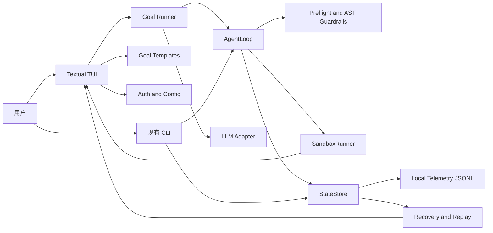
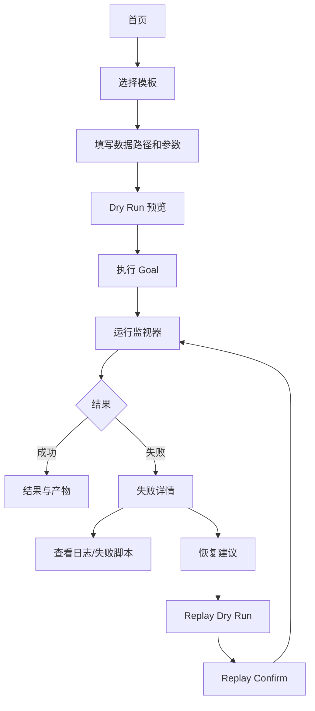

# GIS-Agent-Harness 改造成面向 GIS Agent 的 Codex 风格 TUI 实施说明

## 执行摘要

`GIS-Agent-Harness` 现在已经是一个相当完整的“本地优先、可恢复、可离线测试”的 GIS Agent MVP：它有 Click CLI、`AgentLoop` 最小 ReAct 循环、`LLMRouter`、CRS/几何/AST 护栏、子进程沙箱、`StateStore` 的 Markdown + JSONL 追加式状态快照，以及失败发现、回放、报告导出等恢复命令。仓库明确将范围限定为本地文件、CLI 优先、默认 mock 路由、无 Web 服务、无数据库，同时现有 smoke/acceptance 测试已经覆盖 `demo_task.py`、`demo_recovery.py`、README 工作流和验收审计。换句话说，这个仓库最缺的不是“核心执行引擎”，而是一个更像 Codex 的交互控制面，以及一个能把 GIS 任务模板化、可一键执行的 `goal` 层。citeturn3view0turn3view1turn25view1turn20view3

最稳妥的改造路线不是重写，而是在现有引擎外面加一层 **Textual TUI + Goal Template + LLM Adapter Profile**：CLI 继续作为稳定的自动化接口，TUI 负责多屏幕工作流、键盘操作、运行监控、失败恢复和重放，`goal run` 则把“用户目标”编译成现有 `AgentTask`。这样既不破坏现有离线测试、报告导出和恢复链路，也符合 Codex/AGENTS 的使用方式，因为 Codex 更擅长在有清晰文件边界、测试命令和局部约束的仓库中做增量实现。Textual 的 `App`、`Screen`、`Worker` 和 headless test/Pilot 机制，正好适合这个 TUI MVP。citeturn29view11turn29view12turn29view13turn39search3turn29view8turn29view9turn29view10

建议把 MVP 目标收敛为四件事：第一，新增 `gis-agent-harness tui`；第二，新增 `gis-agent-harness goal run --template ...`；第三，把现有状态、日志、失败脚本、replay 信息接到 TUI；第四，把 LLM 接入层从“当前的 mock/LiteLLM 二选一”升级成“profile 化的 provider 适配层”，但默认仍保持 mock-first 和离线测试。这样能最大程度复用仓库已经具备的 `run-task`、`show-state`、`list-runs`、`resume-hint`、`show-failure-files`、`show-replay`、`show-report`、`replay-last` 和 `export-report` 能力。citeturn3view0turn8view4turn9view3turn10view3turn10view4turn10view5turn9view4turn10view0turn10view2

| 决策 | 建议 |
| --- | --- |
| 控制面 | 采用 **Textual** 做全屏 TUI，保留现有 CLI 不变 |
| 任务表达 | 新增 **YAML goal templates**，把 GIS 任务目标模板化 |
| 模型接入 | 以 **LiteLLM 统一抽象** 为默认，OpenAI/Anthropic/第三方作为 profile |
| 恢复链路 | 不另造轮子，直接复用 `StateStore`、失败脚本归档和 replay 机制 |

## 当前基线与改造原则

现有代码结构已经把核心职责拆得很清楚：`cli.py` 负责命令入口，`config.py` 负责环境变量配置，`llm_router.py` 负责 mock-first 路由与 fallback，`spatial_tools.py` 负责矢量/栅格探测，`guardrails.py` 负责 CRS/几何/AST 检查，`sandbox.py` 负责子进程执行与超时控制，`agent_loop.py` 负责最小 ReAct 循环，`state_store.py` 负责追加式状态持久化。README 和架构文档都把这套职责边界写得很明确。citeturn3view1turn8view4turn7view0

更重要的是，这个仓库已经拥有“做 TUI 所需的大部分后台能力”：`run-task` 能直接得到 `AgentRunResult`；`StateStore` 会把快照写入 `AGENT_STATE.md` 和 `.runs/state.jsonl`；`latest_failed_run_files()` 能定位日志和失败脚本；`latest_failed_run_replay()` 能生成重跑命令；`task_for_run()` / `latest_failed_task()` 能提取原始任务；`agent_loop.py` 还会用 observation fingerprint 在重复问题时提前停止。TUI 不应该重写这些逻辑，而应该把它们可视化。citeturn7view4turn11view2turn11view3turn11view4turn11view5turn33view2turn33view3

目前最明显的缺口有三个。第一，`prompts.py` 只有一个很薄的 `SYSTEM_PROMPT` 和 `json.dumps(payload)`，对复杂 GIS 目标几乎没有模板约束；这意味着“任务目标层”仍然太弱。第二，`.env.example` 已经写了 `LITELLM_CONFIG_PATH=litellm-config.yaml`，但 `HarnessConfig.from_env()` 并没有读取它，说明配置文件和运行时代码之间存在实现缺口。第三，仓库里的 `.codex/config.toml` 目前把 `approval_policy` 设为 `"never"`、`sandbox_mode` 设为 `"danger-full-access"`；这对一次性代码改造方便，但一旦 TUI 允许频繁启动生成脚本，运行时风险就会被放大。citeturn19view0turn32view0turn20view2turn37view0

从 GIS 语义看，现有仓库的“模板化空间”也非常清晰。护栏与 mock router 已经明确把三类问题映射到了标准修复动作：缺失 CRS 时只能 `set_crs()` 声明原始 CRS；CRS 不匹配时用 `to_crs()` 投影到目标 CRS；无效几何时优先 `make_valid()`。GeoPandas 官方文档也正好对应这三种语义：`set_crs()` 是赋值/声明，`to_crs()` 是坐标变换，`make_valid()` 是几何修复。因此，TUI 的第一个版本不应该追求“任意 GIS 规划”，而应该围绕这三类高价值模板构建。citeturn15view5turn12view4turn12view5turn29view3turn29view4turn29view5

## 推荐架构与模块增量

推荐的总体架构是“**现有内核不动，外层增加任务模板、适配层和 TUI**”。理由很简单：仓库已经有可工作的 `AgentLoop`、状态快照和恢复命令；Textual 提供多屏幕和并发 Worker；而 Fiona / Rasterio / GeoPandas 的元数据模型正好对应 GIS Agent 在 TUI 中需要展示的概览面板。矢量侧可以直接展示 `driver`、`crs`、`bounds`、`schema` 和样本 record；栅格侧可以展示 `crs`、`bounds`、`indexes`、`dtypes`、`nodatavals` 和 `transform`，而且仓库当前就坚持“只读元数据，不默认全量读栅格数组”。citeturn18view4turn18view3turn29view7turn29view6turn3view1turn29view11turn29view12turn29view13



建议新增和修改的文件树如下。这里刻意把 TUI 和 provider/profile 逻辑独立出来，避免把 `cli.py` 继续堆成“大一统入口”。

```text
src/gis_agent_harness/
  tui/
    __init__.py
    app.py
    screens.py
    widgets.py
  goal_runner.py
  task_templates.py
  llm_adapters.py
  auth_config.py
  telemetry.py
  state_hooks.py
  cli.py                  # 修改
  config.py               # 修改
  llm_router.py           # 小改，注入 adapter/client
  state_store.py          # 修改，增加 hooks
  sandbox.py              # 修改，增加策略和更细日志
  prompts.py              # 修改，增强模板提示
goals/
  align_vector_to_raster.yaml
  declare_source_crs.yaml
  repair_invalid_geometry.yaml
tests/
  test_tui_smoke.py
  test_goal_cli.py
  test_templates.py
  test_llm_adapters.py
```

| 模块 | 目的 | 新增/修改文件 | 核心 API | CLI 命令 | 最小伪代码 |
| --- | --- | --- | --- | --- | --- |
| TUI | 多屏幕工作流、键盘操作、运行监控、恢复与重放 | `src/gis_agent_harness/tui/app.py`, `screens.py`, `widgets.py` | `GISAgentApp`, `HomeScreen`, `RunScreen`, `RecoveryScreen`, `action_run_goal()` | `gis-agent-harness tui` | `self.run_worker(goal_runner.run(spec), thread=True)` |
| 任务模板 | 把“GIS 目标”编译成 `AgentTask` | `task_templates.py`, `goals/*.yaml`, `goal_runner.py` | `GoalTemplate`, `TemplateRegistry.load()`, `render_task()` | `gis-agent-harness templates list`, `gis-agent-harness goal run --template ...` | `task = registry.render(id, inputs)` |
| LLM 适配层 | 统一 mock / LiteLLM / OpenAI-compatible / Anthropic 接口 | `llm_adapters.py` | `BaseLLMAdapter.complete()`, `MockAdapter`, `LiteLLMAdapter`, `OpenAICompatibleAdapter`, `AnthropicAdapter` | `gis-agent-harness config doctor` | `client = get_adapter(config)` |
| Auth 和配置 | 把 env、YAML profile、TUI 表单输入合并 | `auth_config.py`, 修改 `config.py` | `AppConfig.from_env()`, `load_litellm_profile()`, `mask_secrets()` | `gis-agent-harness config doctor` | `cfg = AppConfig.merge(env, yaml, cli)` |
| Sandbox UX | 在 UI 中展示脚本风险、stdout/stderr、失败脚本位置 | 修改 `sandbox.py`, `tui/widgets.py` | `preview_script_risk()`, `build_failure_view_model()` | 复用现有恢复命令，无需新增硬命令 | `risk = preview_script_risk(script)` |
| State Store Hooks | 让 TUI 和 telemetry 订阅快照，而不是轮询 | `state_hooks.py`, 修改 `state_store.py` | `StateStore(..., hooks=[...])`, `emit_snapshot()` | 复用 `show-state`, `show-replay`, `replay-last` | `for hook in self.hooks: hook(snapshot)` |
| Telemetry | 本地记录运行轨迹、屏蔽敏感字段 | `telemetry.py` | `emit_event()`, `TelemetryWriter`, `redact_payload()` | `gis-agent-harness telemetry export --run-id ...` 可选 | `writer.write(redact(event))` |
| 测试 | 保持离线测试，同时新增 headless TUI smoke | `tests/test_tui_smoke.py` 等 | `run_test()`, `pilot.press()` | `pytest -q` | `async with app.run_test() as pilot:` |

下面的两个最小骨架足以把实现方向钉死。第一段是 `goal template -> AgentTask` 的编译器；第二段是 TUI 启动 run worker 的核心触发点。两者都刻意复用了当前 `AgentTask` / `AgentLoop` 的接口，而不是另起一套并行执行链。

```python
# task_templates.py
from dataclasses import dataclass
from pathlib import Path

@dataclass(slots=True)
class GoalTemplate:
    template_id: str
    title: str
    task_summary_template: str
    requires_raster: bool = False
    requires_source_crs: bool = False

    def render_task(self, *, vector: str, raster: str | None = None, source_crs: str | None = None, max_iterations: int = 3):
        from gis_agent_harness.agent_loop import AgentTask

        return AgentTask(
            task_summary=self.task_summary_template,
            vector_path=str(Path(vector)),
            raster_path=str(Path(raster)) if raster else None,
            source_crs=source_crs,
            max_iterations=max_iterations,
        )
```

```python
# tui/app.py
from textual.app import App
from textual.worker import work

class GISAgentApp(App):
    BINDINGS = [
        ("g", "new_goal", "新建任务"),
        ("r", "run_goal", "执行"),
        ("f", "recovery", "恢复"),
        ("l", "logs", "日志"),
        ("p", "replay", "重放"),
        ("c", "config", "配置"),
        ("q", "quit", "退出"),
    ]

    @work(thread=True)
    def run_goal_worker(self, spec):
        return self.goal_runner.run(spec)
```

LLM 适配层的推荐顺序很明确：**MVP 默认只做 LiteLLM 统一入口 + profile 化 provider**，OpenAI/Anthropic/第三方只是 profile，不必在第一个版本里引入四套完全独立的网络客户端。当前仓库已经通过环境变量支持第三方 OpenAI-compatible endpoint；LiteLLM 官方文档也明确给出了 OpenAI-compatible、Anthropic 和 Proxy `config.yaml` 的路由方式，因此从工程效率看，统一到 LiteLLM 适配器最划算。citeturn3view0turn20view2turn29view0turn29view1turn29view2turn30view0

| 适配器 | 推荐度 | 关键配置字段 | 优点 | 缺点 |
| --- | --- | --- | --- | --- |
| LiteLLM 统一适配器 | 最高 | `provider=litellm`, `model`, `fallback_model`, `api_key`, `api_base`, `reasoning_effort`, `litellm_config_path` | 一层统一 OpenAI / Anthropic / 第三方；天然适合 profile 和 fallback；与现有仓库最接近 | 多一层抽象，调试时需要看 provider/profile 映射 |
| OpenAI 直连适配器 | 中 | `provider=openai`, `OPENAI_API_KEY`, `OPENAI_BASE_URL` 或 `OPENAI_API_BASE`, `model` | 对单一 OpenAI-compatible 服务最直接；与当前 `config.py` 兼容 | Provider 覆盖窄；后续接 Claude/第三方会重复造轮子 |
| Anthropic 直连适配器 | 中 | `provider=anthropic`, `ANTHROPIC_API_KEY`, `ANTHROPIC_API_BASE`, `model` | Claude 独立接入更透明 | 自定义 API Base 有路径后缀细节；与其他 provider 难统一 |
| 第三方 OpenAI-compatible 适配器 | 高 | `provider=openai_compatible`, `api_base`, `api_key`, `model`, `supports_system_message` | 能覆盖 vLLM、反代和第三方 GPT-like 服务；很适合中国区/内网部署 | 经常要处理 `/v1` 路径、system message 兼容性和 JSON 格式差异 |
| MockAdapter | 必保留 | `use_mock=true` | 保证离线测试、CI、演示脚本全可跑 | 不能验证真实 provider 行为 |

再给一个重要的实现判断：现有 `litellm-config.yaml` 文件名和模型名语义都需要梳理。它现在用 `mock-primary` / `mock-fallback` 作为 `model_name`，但底层 `litellm_params.model` 实际写的是 `openai/gpt-4.1-mini`；同时 `.env.example` 里有 `LITELLM_CONFIG_PATH`，但运行代码没有读取它。这会让 TUI 的“模型选择/配置诊断”界面非常混乱。建议把 YAML 真正接到配置层，并把 profile 命名改成 `gis-openai`, `gis-claude`, `gis-vllm`, `mock` 这种面向用户的名称。citeturn31view0turn32view0turn20view2

## 交互流与界面草图

TUI 的工作流应直接映射到仓库已有的运行与恢复生命周期：用户先选择模板并填写输入，再执行 goal，运行中看 observation / planning / action / complete 或 stop 的阶段变化；失败后可以查看失败脚本、日志、下一步建议和 replay；恢复时既可以 dry-run 预览，也可以 confirm 真正执行。Textual 的 `Screen` 适合把这些阶段拆成多个界面，`Worker` 适合跑长任务而不阻塞 UI，而 `active_bindings` 可以用来动态显示当前界面的快捷键帮助。citeturn29view13turn39search10turn29view14turn8view3turn11view2turn11view3



| 屏幕 | 主要内容 | 快捷键 | 行为 |
| --- | --- | --- | --- |
| 首页 | 最近运行、模板目录、配置状态 | `g` 新建、`f` 恢复、`c` 配置、`q` 退出 | 进入常用入口 |
| 模板向导 | 模板说明、必填输入、预检查摘要 | `tab` 切换、`enter` 下一步、`d` dry-run | 生成 GoalSpec |
| 运行监视器 | 当前 stage、observations、decision、模型、stdout/stderr | `l` 日志、`p` 预览脚本、`esc` 返回 | 实时展示 run 进度 |
| 结果页 | 成功摘要、输出路径、报告入口 | `o` 打开产物、`r` 重新运行 | 快速复用 |
| 恢复页 | 最近失败 run、`next_step_hint`、replay 命令、失败脚本 | `enter` 打开、`d` dry-run、`r` replay | 基于 StateStore 恢复 |
| 配置页 | Provider profile、密钥状态、health check | `s` 保存、`t` test provider | 做接入诊断 |
| 快捷键面板 | 当前屏幕 active bindings | `?` | 自动从 Textual 绑定读取 |

下面两个 ASCII 草图可以直接作为 TUI MVP 的布局锚点。

```text
┌ GIS Agent Harness ─ 首页 ───────────────────────────────────────────────┐
│ 模板                         │ 最近运行                    │ 配置状态    │
│ > align_vector_to_raster     │ RUN-20260527-1012 failed   │ provider=mock│
│   declare_source_crs         │ RUN-20260527-1001 success  │ model=mock   │
│   repair_invalid_geometry    │ RUN-20260526-2210 failed   │ sandbox=20s  │
│                              │                             │ telemetry=on │
├──────────────────────────────┴─────────────────────────────┴────────────┤
│ [g] 新建任务  [f] 恢复  [c] 配置  [l] 日志  [p] 重放  [?] 帮助  [q] 退出 │
└──────────────────────────────────────────────────────────────────────────┘
```

```text
┌ 运行监视器 ─ RUN-20260527-1012 ─────────────────────────────────────────┐
│ Stage: observe -> thought -> action -> stop                            │
│ Summary: Vector CRS EPSG:3857 does not match raster CRS EPSG:4326      │
│ Model: gis-openai     Fallback: false     Iteration: 1/3               │
├ Observations ───────────────────┬ Logs / Script Preview ────────────────┤
│ - crs_mismatch                  │ stdout:                               │
│   suggested_fix: to_crs(...)    │ /.../.runs/artifacts/RUN/...gpkg      │
│ - next_step_hint: to_crs(...)   │ stderr:                               │
│                                  │                                       │
├ Failure / Replay ────────────────────────────────────────────────────────┤
│ [d] Dry Run Replay   [r] Replay Confirm   [o] Open failure files        │
└──────────────────────────────────────────────────────────────────────────┘
```

恢复设计上，TUI 不应该自己重算 replay 逻辑，而应该直接消费现有 `StateStore` 和 CLI 语义。当前 `run_summary()` 已经给出 `next_step_hint`；`latest_failed_run_files()` 已经给出 `log_dir`、`log_json_files`、`log_py_files` 和 `failed_scripts`；`latest_failed_run_replay()` 已经能生成合法的 rerun command；`replay-last` 还支持 `--dry-run` 和 `--confirm`。因此 TUI 的恢复页本质上只是把这些已有信息更友好地呈现出来。citeturn11view1turn11view2turn11view3turn10view0turn3view0

## 安全配置与部署

当前仓库已经做了三层基础保护：数据预检查会在运行前拦截缺失 CRS、CRS 不匹配和无效几何；AST 护栏只允许 GIS 和少量安全标准库 import，并明确拦截 `os`、`subprocess`、`requests`、`socket`、`urllib` 等危险导入及 `eval` / `exec` / `compile` / `__import__`；`SandboxRunner` 会在运行前再做 AST 校验，记录脚本和 JSON 日志，并在失败或超时时归档失败脚本。测试也明确覆盖了危险 import 拦截、缺失 CRS、CRS mismatch 和沙箱 timeout。citeturn16view0turn17view0turn17view1turn17view2turn24view2

但改成 TUI 后，安全模型必须再收紧一层。原因是当前沙箱的 `cwd` 是 `run_root` 的父目录，而不是更严格的工件目录；同时 `.codex/config.toml` 当前启用了 `danger-full-access`。对于“由 TUI 频繁触发生成脚本”的模式，这意味着虽然网络/OS/shell 调用会被 AST 拦掉，但文件系统写入面仍偏大。建议把运行时 sandbox 策略从“只有 AST + timeout”升级成“AST + timeout + 输出目录白名单 + 敏感字段脱敏 + 日志风险预览”。citeturn17view0turn17view4turn37view0

| 安全域 | 当前仓库现状 | TUI MVP 建议 |
| --- | --- | --- |
| 脚本静态检查 | 已有 import whitelist / dangerous call block | 保留；在 TUI 中加“风险预览面板”显示被允许的 import/call |
| 运行超时 | 已有 `timeout_seconds` | 保留；TUI 中可调但限定上限，例如 60 秒 |
| 失败归档 | 已有 `.runs/failed/<run_id>-<step>.py` | 在 UI 中直接打开失败脚本与对应 JSON 日志 |
| 输出路径 | 当前主要依赖 router 生成工件路径 | 增加 `sandbox_write_root=.runs/artifacts` 白名单，只允许写该目录 |
| 日志脱敏 | 当前未见统一脱敏层 | `telemetry.py` 与 `config doctor` 中对 key/base_url 之外字段做掩码 |
| 密钥存储 | 当前主要靠 env | TUI 只显示“已配置/未配置/最后四位”，不回写到状态快照 |
| Codex 执行环境 | 当前 `.codex/config.toml` 为无审批、全权限 | 仅把此配置视为“代码改造环境”；不要让 TUI 继承同等级运行权限概念 |

建议把配置层整理成“环境变量兼容旧值 + LiteLLM YAML profile + TUI 表单覆盖”的三层合并，并显式把 provider/profile 相关字段纳入 `HarnessConfig`。当前 `.env.example` 已经包含 `GIS_AGENT_HARNESS_*`、`OPENAI_*` 和 `LITELLM_CONFIG_PATH`，而现有代码只读取前两类的一部分，因此扩展 `config.py` 是必要工作。citeturn32view0turn20view2

下面给出一个可直接落地的 `.env` 示例。它保持了现有变量前缀，也加入了 TUI/telemetry/sandbox 的新增键。

```dotenv
GIS_AGENT_HARNESS_USE_MOCK=false
GIS_AGENT_HARNESS_PROVIDER=litellm
GIS_AGENT_HARNESS_PRIMARY_MODEL=gis-openai
GIS_AGENT_HARNESS_FALLBACK_MODEL=gis-claude
GIS_AGENT_HARNESS_API_BASE=
GIS_AGENT_HARNESS_API_KEY=
GIS_AGENT_HARNESS_REASONING_EFFORT=medium

GIS_AGENT_HARNESS_RUN_ROOT=.runs
GIS_AGENT_HARNESS_STATE_FILE=AGENT_STATE.md
GIS_AGENT_HARNESS_TIMEOUT_SECONDS=30
GIS_AGENT_HARNESS_SANDBOX_WRITE_ROOT=.runs/artifacts
GIS_AGENT_HARNESS_TELEMETRY_LOCAL_ONLY=true

OPENAI_API_KEY=
OPENAI_BASE_URL=
OPENAI_API_BASE=
ANTHROPIC_API_KEY=
ANTHROPIC_API_BASE=

LITELLM_CONFIG_PATH=litellm-config.yaml
```

下面是更建议的 `litellm-config.yaml`。它把 provider profile 语义化，也把第三方 OpenAI-compatible provider 与 Anthropic 拆开。LiteLLM 官方文档明确要求 OpenAI-compatible provider 使用 `openai/` 前缀，并提示 `api_base` 常需要 `/v1`；Anthropic 文档则提醒自定义 API base 可能自动拼接 `/v1/messages` 或 `/v1/complete`。citeturn30view0turn30view1turn29view1turn30view3turn29view2

```yaml
model_list:
  - model_name: gis-openai
    litellm_params:
      model: openai/gpt-4.1-mini
      api_key: os.environ/OPENAI_API_KEY
      api_base: os.environ/OPENAI_BASE_URL

  - model_name: gis-claude
    litellm_params:
      model: anthropic/claude-sonnet-4-20250514
      api_key: os.environ/ANTHROPIC_API_KEY
      api_base: os.environ/ANTHROPIC_API_BASE

  - model_name: gis-thirdparty
    litellm_params:
      model: openai/your-model-name
      api_key: os.environ/GIS_AGENT_HARNESS_API_KEY
      api_base: os.environ/GIS_AGENT_HARNESS_API_BASE
      supports_system_message: false

router_settings:
  routing_strategy: simple-shuffle
  num_retries: 1
```

开发、打包和部署建议也应继续围绕“默认离线、mock-first、文档可复制”来设计。当前项目入口是 `gis-agent-harness = gis_agent_harness.cli:main`，测试基线是 `pytest -q`，而 smoke/acceptance 脚本已经覆盖多个端到端场景。TUI 增量应尽量不改变这些基础命令，只新增 `tui`、`goal run` 和 TUI 对应的测试。citeturn20view3turn25view1turn21view1

| 环节 | 建议命令 | 说明 |
| --- | --- | --- |
| 安装 | `python -m pip install -e .[dev]` | `dev` 中新增 `pytest-asyncio`；核心依赖新增 `textual`、`pyyaml` |
| 初始化夹具 | `python3 scripts/generate_sample_data.py` | 保持现有本地自举能力 |
| 核心测试 | `pytest -q` | 必须继续默认离线 |
| TUI 测试 | `pytest -q tests/test_tui_smoke.py` | 使用 Textual `run_test()` / Pilot |
| Goal CLI 测试 | `pytest -q tests/test_goal_cli.py` | 确保模板到 `AgentTask` 的转换链路可测 |
| 运行 TUI | `python3 -m gis_agent_harness.cli tui` | 主入口 |
| 运行 goal | `python3 -m gis_agent_harness.cli goal run --template align_vector_to_raster ...` | 非交互自动化入口 |
| 打包验证 | `python -m build` 可选 | 若要发布包，则增加构建验证 |
| CI | `pytest -q && python3 scripts/demo_task.py && python3 scripts/demo_recovery.py` | 保持现有 smoke 基线，可额外加入 TUI smoke |

## Codex 一键目标

Codex 官方文档强调两点：一是 Codex 会在开始工作前读取仓库中的 `AGENTS.md`；二是 `AGENTS.md` 应该尽量短、小、准，并明确测试方式与约束。当前仓库已经有根级 `AGENTS.md` 和 `.codex/config.toml`，因此最适合的“一键 goal”做法不是再发散成多个模糊说明文件，而是直接给 Codex 一个 **明确的、指向具体文件路径和测试命令的单次执行目标提示词**。citeturn29view8turn29view9turn29view10turn37view0

建议本次改造让 Codex 只做下面这些文件变化，不做范围外扩展。

| 文件 | 动作 | 高层补丁说明 |
| --- | --- | --- |
| `src/gis_agent_harness/tui/__init__.py` | 新增 | TUI 包入口 |
| `src/gis_agent_harness/tui/app.py` | 新增 | Textual App、绑定、worker、screen 跳转 |
| `src/gis_agent_harness/tui/screens.py` | 新增 | 首页、向导、运行监视器、恢复页、配置页 |
| `src/gis_agent_harness/tui/widgets.py` | 新增 | 状态面板、日志面板、风险预览面板 |
| `src/gis_agent_harness/task_templates.py` | 新增 | YAML 模板读取与 `AgentTask` 渲染 |
| `src/gis_agent_harness/goal_runner.py` | 新增 | `GoalSpec -> AgentLoop.run()` |
| `src/gis_agent_harness/llm_adapters.py` | 新增 | provider/profile adapter 工厂 |
| `src/gis_agent_harness/auth_config.py` | 新增 | env/YAML/profile 合并、密钥掩码、doctor |
| `src/gis_agent_harness/telemetry.py` | 新增 | 本地 JSONL telemetry |
| `src/gis_agent_harness/state_hooks.py` | 新增 | 快照 hook 协议与事件广播 |
| `src/gis_agent_harness/cli.py` | 修改 | 新增 `tui`、`templates`、`goal run`、`config doctor` |
| `src/gis_agent_harness/config.py` | 修改 | 新增 provider/profile/TUI/sandbox/telemetry 配置 |
| `src/gis_agent_harness/llm_router.py` | 修改 | 接收 adapter/client 工厂，而不是只写死 LiteLLMClient |
| `src/gis_agent_harness/state_store.py` | 修改 | 增加 hooks 和更方便的 run/tail 接口 |
| `src/gis_agent_harness/sandbox.py` | 修改 | 加输出目录白名单、风险视图数据结构 |
| `src/gis_agent_harness/prompts.py` | 修改 | 引入模板感知的更强 prompt |
| `goals/*.yaml` | 新增 | 至少三个内置目标模板 |
| `tests/test_tui_smoke.py` | 新增 | headless TUI smoke |
| `tests/test_goal_cli.py` | 新增 | `goal run` 测试 |
| `tests/test_templates.py` | 新增 | 模板解析/渲染测试 |
| `tests/test_llm_adapters.py` | 新增 | adapter 选择与 mock 测试 |
| `pyproject.toml` | 修改 | 增加 `textual`、`pyyaml`、`pytest-asyncio` |
| `.env.example` | 修改 | 补齐 provider/profile/TUI/sandbox/telemetry |
| `litellm-config.yaml` | 修改 | 用真实 provider profile 替换误导性的命名 |
| `.codex/config.toml` | 修改 | 增加 `tui`、`goal_run`、`config_doctor` 命令别名 |
| `README.md` / `docs/architecture.md` / `AGENTS.md` | 修改 | 更新使用说明、架构图、测试和约束 |

下面这段就是推荐直接粘贴给 Codex 的“单次执行目标提示词”。它足够具体，可以直接驱动改造；同时又把 MVP 边界限定在“基于现有内核做 TUI + goal 层”，不会把仓库推成 Web 服务或大而全平台。

```markdown
你正在修改仓库 `GIS-Agent-Harness`。请在**不破坏现有 CLI、离线测试和恢复工作流**的前提下，把它改造成一个 **Codex 风格、面向 GIS agent 任务的 Textual TUI MVP**。

目标边界：
1. 保留现有 `run-task`、`show-state`、`list-runs`、`resume-hint`、`show-failure-files`、`show-replay`、`replay-last`、`export-report`、`show-report`。
2. 新增 `python3 -m gis_agent_harness.cli tui`。
3. 新增 `python3 -m gis_agent_harness.cli templates list`。
4. 新增 `python3 -m gis_agent_harness.cli goal run --template TEMPLATE_ID ...`，其内部将模板编译为现有 `AgentTask` 并调用现有 `AgentLoop`。
5. 新增 provider/profile 适配层，默认保留 mock；LiteLLM 为统一入口，OpenAI-compatible / Anthropic / third-party 作为 profile。
6. TUI 必须支持：模板选择、参数填写、dry-run 预览、运行监视、失败恢复、日志查看、replay。
7. 所有新增测试默认离线；真实 provider 只做配置与 doctor，不进入默认 CI。
8. 不要把项目改成 Web 服务、数据库项目或前后端分离项目。

必须新增文件：
- `src/gis_agent_harness/tui/__init__.py`
- `src/gis_agent_harness/tui/app.py`
- `src/gis_agent_harness/tui/screens.py`
- `src/gis_agent_harness/tui/widgets.py`
- `src/gis_agent_harness/task_templates.py`
- `src/gis_agent_harness/goal_runner.py`
- `src/gis_agent_harness/llm_adapters.py`
- `src/gis_agent_harness/auth_config.py`
- `src/gis_agent_harness/telemetry.py`
- `src/gis_agent_harness/state_hooks.py`
- `goals/align_vector_to_raster.yaml`
- `goals/declare_source_crs.yaml`
- `goals/repair_invalid_geometry.yaml`
- `tests/test_tui_smoke.py`
- `tests/test_goal_cli.py`
- `tests/test_templates.py`
- `tests/test_llm_adapters.py`

必须修改文件：
- `src/gis_agent_harness/cli.py`
- `src/gis_agent_harness/config.py`
- `src/gis_agent_harness/llm_router.py`
- `src/gis_agent_harness/state_store.py`
- `src/gis_agent_harness/sandbox.py`
- `src/gis_agent_harness/prompts.py`
- `pyproject.toml`
- `.env.example`
- `litellm-config.yaml`
- `.codex/config.toml`
- `README.md`
- `docs/architecture.md`
- `AGENTS.md`

实现要求：
- 使用 `textual` 实现 TUI；长任务必须通过 Textual worker 执行，避免阻塞 UI。
- 使用现有 `AgentLoop` / `StateStore` / `SandboxRunner`，不要复制逻辑。
- 给 `StateStore` 增加 hooks，使 TUI 和 telemetry 可以订阅 snapshot append 事件。
- `goal run` 必须支持至少 3 个内置模板：
  - `align_vector_to_raster`
  - `declare_source_crs`
  - `repair_invalid_geometry`
- 模板产物必须转换为 `AgentTask`，不要发展出第二套执行对象模型。
- `config doctor` 必须能检查 mock / LiteLLM / OpenAI-compatible / Anthropic 配置是否齐全，但默认不发真实请求。
- `sandbox.py` 增加输出目录白名单与风险预览数据结构；UI 中展示脚本、stdout、stderr、失败归档路径。
- `.env.example` 与 `config.py` 必须保持一致，特别是 `LITELLM_CONFIG_PATH` 必须真正接入。
- `litellm-config.yaml` 里的 profile 命名必须清晰，不要继续用 `mock-primary`/`mock-fallback` 指向 live 模型。
- 根级 `AGENTS.md` 保持简洁，只写关键命令、测试方式和边界约束。

测试与停止条件：
1. `pytest -q` 通过。
2. `pytest -q tests/test_tui_smoke.py` 通过。
3. `python3 scripts/demo_task.py` 通过。
4. `python3 scripts/demo_recovery.py` 通过。
5. `python3 scripts/demo_readme_workflow.py` 通过。
6. `python3 scripts/verify_acceptance.py --skip-pytest` 通过，或在文档中补充新的 TUI/goal 验收项。
7. README 中补充 TUI 与 `goal run` 的可复制命令。
8. 若 live provider 接入拖慢进度，优先保证 mock 和 LiteLLM profile 架构落地，不得阻塞 TUI MVP 交付。

输出要求：
- 给出完整 patch。
- 给出新增文件内容。
- 运行测试并修复失败。
- 最终总结中列出新增命令、文件和通过的测试。
```

## 测试验收与路线图

测试策略必须建立在现有仓库已经形成的“离线默认、脚本 smoke、README 可复制、验收审计”基础上。当前测试树已经覆盖 `test_cli.py`、`test_agent_loop.py`、`test_guardrails.py`、`test_llm_router.py`、`test_spatial_tools.py`、`test_e2e_smoke.py` 等；其中 smoke 还会跑 `demo_task.py`、`demo_failures.py`、`demo_recovery.py`、`demo_readme_workflow.py` 和 `verify_acceptance.py`。TUI 增量不能替代这些测试，只能叠加 headless smoke。Textual 官方则明确支持 `run_test()` 和 Pilot 驱动，用来做无终端输出的 UI 测试。citeturn22view0turn25view1turn39search0turn39search3

| 验收项 | 通过标准 |
| --- | --- |
| 现有 CLI 不回退 | 现有 README 命令和 smoke 脚本仍然通过 |
| `tui` 可启动 | `python3 -m gis_agent_harness.cli tui` 能启动主界面 |
| `goal run` 可执行 | 至少一个模板在样例数据上成功完成或进入可恢复失败态 |
| 任务模板正确 | 模板渲染出的对象就是现有 `AgentTask` |
| 恢复链路可用 | TUI 能显示失败 run、失败脚本、replay dry-run 与 confirm |
| 安全基线不降低 | AST 护栏、timeout、失败归档测试仍通过 |
| 配置诊断可用 | `config doctor` 能识别 mock/LiteLLM/provider profile 缺口 |
| 离线默认成立 | 默认 `pytest -q` 不需要真实 API key |
| 文档同步 | README、架构文档、AGENTS 和 `.env.example` 一致 |

| 优先级 | 任务 | 预估工时 |
| --- | --- | --- |
| P0 | 新建 `task_templates.py`、`goal_runner.py`，打通 `goal run -> AgentTask -> AgentLoop` | 3–4 小时 |
| P0 | 新建 `llm_adapters.py`，把 mock/LiteLLM/provider profile 抽象出来 | 3–5 小时 |
| P0 | 扩展 `config.py` / `auth_config.py`，真正接通 `.env.example` 与 `litellm-config.yaml` | 2–4 小时 |
| P0 | 修改 `state_store.py` 增加 hooks，最小 telemetry JSONL | 2–3 小时 |
| P0 | 最小 Textual app：首页、模板向导、运行页、恢复页 | 6–8 小时 |
| P1 | 改进 `sandbox.py` 的输出路径白名单与风险预览 | 2–4 小时 |
| P1 | 增加 `config doctor`、TUI 配置页、provider profile 检查 | 3–4 小时 |
| P1 | 新增 TUI/Goal 测试与现有 smoke 兼容修复 | 4–6 小时 |
| P1 | 更新 README、`docs/architecture.md`、`AGENTS.md`、`.codex/config.toml` | 2–3 小时 |
| P2 | 更丰富的模板库、结果 diff 预览、日志过滤 | 4–6 小时 |

综合来看，**可交付的 TUI MVP** 约需 **27–41 小时**。如果需要继续压缩范围，最值得保留的子集是：`goal run`、Textual 首页 + 运行监视器、恢复页、LiteLLM profile 适配层，以及 headless TUI smoke 测试。最不应该在首轮里做的是数据库、远程任务队列、地图可视化渲染器或 Web API，因为这些都偏离了仓库当前“本地优先、CLI/脚本可审计、离线可跑”的核心优势。citeturn3view0turn3view1turn25view1turn29view11turn29view12turn29view13